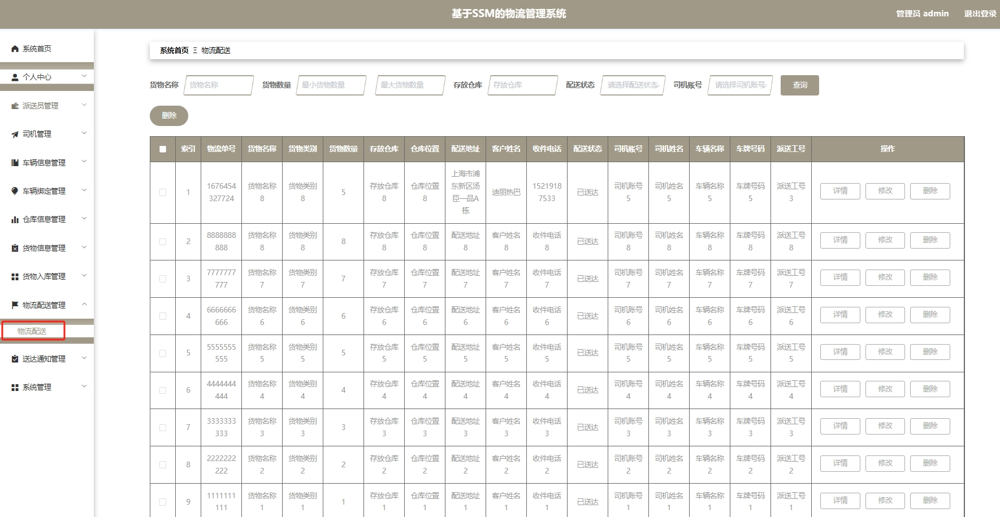

# 1.项目介绍
- 项目测试环境：IDEA2022，Tomcat8.5，MySQL5.7+，Maven3，Navicat
- 项目技术栈：SSM，Vue，fastjson，druid等
- 项目角色：管理员、派送员。司机
- 功能模块：派送员管理，司机管理，车辆管理、库存管理、订单管理、货物管理等

# 2.项目部署
- 通过navicat创建数据库，编码为utf8mb4，然后导入sql文件
- 根据本地数据库配置，修改src/main/resources/config.properties  3-5行
- 配置tomcat，注意将Deployment的Application context配置为/ssmh5776 （当然你也可以根据src/main/webapp/admin/vue.config.js 37行自行修改）
- 启动项目，运行管理web:  http://localhost:8080/ssmh5776/admin/dist/index.html
- 管理员账号 admin/admin ，司机、派送员账号自行查看数据库，密码为123456
**项目经过本人本地测试，确保完整并正常运行，部署有问题请不要怀疑项目的完整性。**

# 3.项目部分截图

# 4.获取方式
[戳我查看](https://gitee.com/aven999/mall)